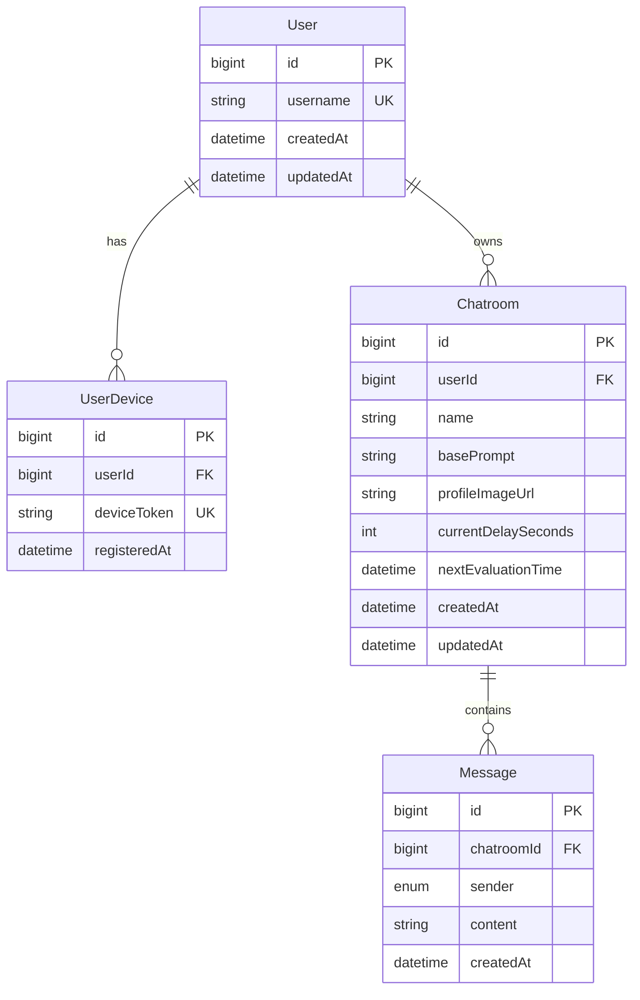
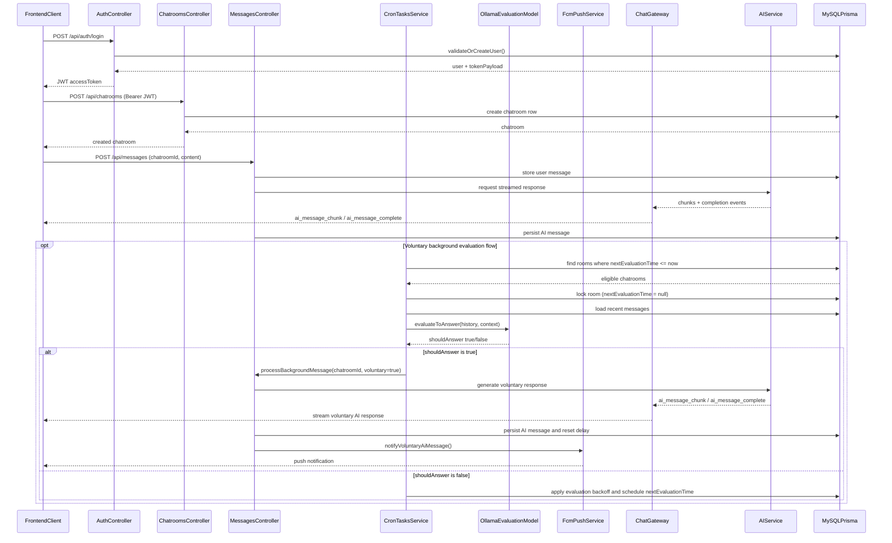

# Chatty Backend

Chatty is a real-time, AI-based chat application backend built with **NestJS**, **TypeScript**, and **Prisma ORM**.

## Tech Stack
- **Framework**: [NestJS](https://nestjs.com/)
- **Language**: [TypeScript](https://www.typescriptlang.org/)
- **Database**: MySQL via [Prisma ORM](https://www.prisma.io/)
- **Testing**: Jest & Supertest (Unit & E2E)
- **Static Assets**: `@nestjs/serve-static` & `@nestjs/platform-express` (Multer) for image uploads

## Prerequisites
- **Node.js** (v18+ recommended)
- **MySQL** Server

## Getting Started

1. **Install Dependencies**
   ```bash
   npm install
   ```

2. **Environment Configuration**
   Ensure you have a `.env` file at `backend/.env` containing your Database URL.
   ```env
   DATABASE_URL="mysql://<user>:<password>@localhost:3306/chatty"
   JWT_SECRET="replace-with-a-strong-secret"
   JWT_EXPIRES_IN="7d"
   OLLAMA_HOST="http://127.0.0.1:11434"
   OLLAMA_CHAT_MODEL="hf.co/soob3123/amoral-gemma3-12B-v2-qat-Q4_0-GGUF:Q4_0"
   OLLAMA_EVAL_MODEL="qwen2.5:1.5b"
   ```

3. **Database Setup**
   Run Prisma migrations and generate Prisma Client bindings:
   ```bash
   npm run prisma:migrate:dev
   npx prisma generate
   ```

4. **Running the Application**
   ```bash
   # development
   npm run start

   # watch mode
   npm run dev

   # production mode
   npm run start:prod
   ```

## WebSocket Streaming

AI response streaming is delivered over Socket.IO via the backend gateway.

- Client events:
  - `joinRoom` with `{ chatroomId: number }`
  - `leaveRoom` with `{ chatroomId: number }`
- Server events:
  - `ai_typing_state` with `{ chatroomId: number, isTyping: boolean }`
  - `ai_message_chunk` with `{ chatroomId: number, chunk: string }`
  - `ai_message_complete` with `{ chatroomId: number, content: string, messageId: number }`

Note: current WebSocket room join/leave does not enforce JWT auth at gateway level.

## Features Implemented
- **Chatrooms (CRUD)**: Create, View, Update, and Delete customized DB Chatrooms. Native file uploading handles saving profile images seamlessly locally into `src/assets` and hosts them via `.baseUrl`.
- **Messages Management**: Send user messages to the AI and read chat histories attached securely to specific Chatroom constraints.
- **Robust Testing**: Comprehensive Unit tests and End-to-End (E2E) Integration Tests spanning live Database evaluations (`/test/chatrooms.e2e-spec.ts` & `/test/messages.e2e-spec.ts`).
- **JWT Authentication**: `POST /api/auth/login` issues bearer tokens used by protected API routes.

## Running Tests

```bash
# Unit tests
npm run test

# End-to-End (E2E) integration tests
npm run test:e2e

# Test coverage
npm run test:cov
```

## Linter & Formatter

```bash
# Run linting
npm run lint
```

## Project Structure

This section summarizes backend relationships, file layout, and the main request flow.

### File Structure

```text
backend/
├── prisma/              # Prisma schema, migrations, and DB setup
├── src/
│   ├── auth/            # Authentication (login, JWT handling)
│   ├── chatrooms/       # Chatroom CRUD and configuration logic
│   ├── messages/        # Message APIs and chat history operations
│   ├── websocket/       # Socket.IO gateway and streaming events
│   ├── assets/          # Uploaded/static files (e.g., profile images)
│   └── ...              # Shared modules, bootstrap, and app wiring
└── test/                # E2E and integration tests
```

### Entity Relations



### Sequence Diagram


