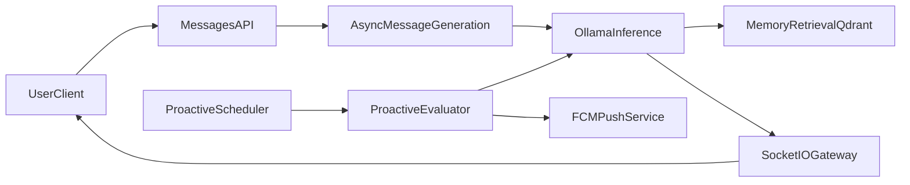

# Chatty Project Context for Programming AI Agents (Current State)

This document describes the implemented current state of Chatty so coding agents can reason correctly about behavior, constraints, and delivery expectations.

## 1) Project Snapshot

Chatty is an AI chat product with two core interaction modes:

- user-initiated messaging with real-time streamed AI responses
- scheduled proactive AI messages when the system decides it should re-engage

Monorepo structure:

- `frontend/`: React 19 app (Vite) for chat UX, streaming display, chatroom management, and optional web push.
- `backend/`: NestJS 11 API + Socket.IO gateway + scheduler + inference/memory orchestration.
- `deploy/`: Docker Compose definitions, nginx runtime image wiring, deploy scripts.
- `documents/`: API/schema/proposal/CI-CD reference docs.

Primary source: [../../README.md](../../README.md)

## 2) Business Logic (Implemented Behavior)

### 2.1 Authentication and identity model

- Most API routes under `/api/**` require JWT Bearer auth.
- Public endpoints include `GET /` and `POST /api/auth/login`.
- The product supports guest sessions and member users.
- Guest-to-member merge moves guest-owned artifacts into the member scope and prevents invalid re-merge paths.

Primary references:

- [../../documents/API_DOCUMENTATION.md](../../documents/API_DOCUMENTATION.md)
- [../../backend/src/auth/services/auth.service.ts](../../backend/src/auth/services/auth.service.ts)
- [../../backend/src/auth/controllers/auth.controller.ts](../../backend/src/auth/controllers/auth.controller.ts)
- [../../backend/src/app.module.ts](../../backend/src/app.module.ts)

### 2.2 Chatroom ownership and lifecycle

- A chatroom is owned by either a `userId` or a `guestSessionId`.
- CRUD operations are owner-scoped.
- Chatroom customization supports name, base prompt, and optional profile image.
- Clone vs branch are intentionally different:
  - clone: copies configuration only
  - branch: copies configuration and message history

Primary references:

- [../../documents/API_DOCUMENTATION.md](../../documents/API_DOCUMENTATION.md)
- [../../backend/src/chatrooms/services/chatrooms.service.ts](../../backend/src/chatrooms/services/chatrooms.service.ts)
- [../../backend/src/chatrooms/repositories/chatrooms.repository.ts](../../backend/src/chatrooms/repositories/chatrooms.repository.ts)

### 2.3 Messaging lifecycle and real-time UX contract

- User send API stores the user message and returns `202 Accepted` with `processing`.
- AI generation is asynchronous and streamed over Socket.IO.
- Streaming event semantics are cumulative for chunks (`ai_message_chunk` carries full content-so-far, not deltas).
- Completion is emitted via `ai_message_complete`; typing state via `ai_typing_state`.

Primary references:

- [../../documents/API_DOCUMENTATION.md](../../documents/API_DOCUMENTATION.md)
- [../../backend/src/messages/controllers/messages.controller.ts](../../backend/src/messages/controllers/messages.controller.ts)
- [../../backend/src/messages/services/message-send.service.ts](../../backend/src/messages/services/message-send.service.ts)
- [../../backend/src/messages/gateways/messages.gateway.ts](../../backend/src/messages/gateways/messages.gateway.ts)

### 2.4 Proactive AI scheduling behavior

- Scheduler repeatedly evaluates eligible chatrooms.
- Eligibility is based on timing fields such as `nextEvaluationTime`.
- Delay/backoff behavior is modeled via delay fields and scheduling constants.
- Consecutive proactive sends are capped to avoid runaway unsolicited messaging.

Primary references:

- [../../backend/src/tasks/services/tasks.service.ts](../../backend/src/tasks/services/tasks.service.ts)
- [../../backend/src/tasks/constants/scheduling.constants.ts](../../backend/src/tasks/constants/scheduling.constants.ts)
- [../../backend/src/inference/tasks/proactive-evaluator.service.ts](../../backend/src/inference/tasks/proactive-evaluator.service.ts)
- [../../documents/PROJECT_PROPOSAL.md](../../documents/PROJECT_PROPOSAL.md)

### 2.5 Memory and retrieval augmentation

- The backend extracts/stores memory artifacts and retrieves relevant snippets during generation.
- Long-term retrieval uses Qdrant; canonical/structured memory persists in MySQL via Prisma models.
- Memory has typed categories and deduplication constraints in schema.

Primary references:

- [../../backend/src/inference/tasks/chat-generation.service.ts](../../backend/src/inference/tasks/chat-generation.service.ts)
- [../../backend/src/inference/providers/ollama/ollama-provider.module.ts](../../backend/src/inference/providers/ollama/ollama-provider.module.ts)
- [../../backend/prisma/schema.prisma](../../backend/prisma/schema.prisma)
- [../../documents/SCHEMA.md](../../documents/SCHEMA.md)

### 2.6 Notifications behavior

- Device token registration is user-authenticated and deduplicated by token.
- Push delivery is optional and depends on Firebase credentials/config.
- Proactive messaging can trigger push notifications for eligible user-owned chatrooms.

Primary references:

- [../../backend/src/notifications/services/notifications.service.ts](../../backend/src/notifications/services/notifications.service.ts)
- [../../backend/src/notifications/services/fcm-push.service.ts](../../backend/src/notifications/services/fcm-push.service.ts)
- [../../documents/API_DOCUMENTATION.md](../../documents/API_DOCUMENTATION.md)

### 2.7 Explicitly not implemented as core product modules

No concrete current backend modules for billing/subscription or admin/moderation were identified in the API surface. Treat those as out-of-scope unless new code introduces them.

## 3) Technical Requirements for AI Agents

### 3.1 Runtime stack

- Frontend: React 19, TypeScript, Vite 7, Tailwind 4, TanStack Query, Socket.IO client.
- Backend: NestJS 11, TypeScript, Prisma, Socket.IO gateway.
- Data and AI infrastructure: MySQL 8, Ollama, Qdrant.

Primary references:

- [../../README.md](../../README.md)
- [../../frontend/README.md](../../frontend/README.md)
- [../../backend/README.md](../../backend/README.md)

### 3.2 Required vs optional infrastructure

Required for core product behavior:

- MySQL
- Backend API process
- Ollama availability matching configured models

Required for full long-term memory retrieval:

- Qdrant

Optional/feature-gated:

- Firebase Admin/Web + VAPID (push notifications)

Primary references:

- [../../deploy/README.md](../../deploy/README.md)
- [../../backend/README.md](../../backend/README.md)
- [../../frontend/README.md](../../frontend/README.md)

### 3.3 API and socket contract constraints

- `/api/**` defaults to JWT-protected except explicitly public endpoints.
- IDs are serialized as strings in JSON due to BigInt-safe serialization.
- WebSocket join/leave handlers currently do not enforce JWT at gateway level.
- Message send is request/accept pattern (`202`) followed by socket stream for AI output.

Primary references:

- [../../documents/API_DOCUMENTATION.md](../../documents/API_DOCUMENTATION.md)
- [../../backend/src/messages/gateways/messages.gateway.ts](../../backend/src/messages/gateways/messages.gateway.ts)

### 3.4 Data model invariants

- Core IDs are BigInt in Prisma/MySQL models.
- Chatroom can belong to either user or guest session.
- Memory rows have uniqueness by `(chatroomId, kind, key)`.
- AI message metadata is keyed 1:1 by `messageId`.

Primary references:

- [../../backend/prisma/schema.prisma](../../backend/prisma/schema.prisma)
- [../../documents/SCHEMA.md](../../documents/SCHEMA.md)

### 3.5 Quality gates and CI expectations

Before proposing merge-ready changes, agents should run relevant checks in changed areas:

- backend: lint, unit tests, e2e where behavior changes, build
- frontend: lint, typecheck, tests, build

Branch protection expects checks such as `verify-commits`, `backend-checks`, and `frontend-checks`.

Primary references:

- [../../backend/README.md](../../backend/README.md)
- [../../frontend/README.md](../../frontend/README.md)
- [../ci-cd.md](../ci-cd.md)

### 3.6 Coding standards and implementation rules

- Keep backend modular: Module -> Controller/Gateway -> Service -> Repository.
- Keep business logic in services, not controllers/gateways.
- Keep API contracts/types centralized in frontend.
- Preserve strict TypeScript and avoid `any`.
- Keep imports at top-level (no inline imports) unless unavoidable and documented.
- Use exhaustive switch handling (`never` check) for unions/enums.

Primary references:

- [../../.cursor/rules/backend.mdc](../../.cursor/rules/backend.mdc)
- [../../.cursor/rules/frontend.mdc](../../.cursor/rules/frontend.mdc)
- [/Users/junghyeoklee/.cursor/plugins/cache/cursor-public/cursor-team-kit/7dd9fea1e0e9bb88fcf059f5e77eb5a9d31bef1e/rules/no-inline-imports.mdc](/Users/junghyeoklee/.cursor/plugins/cache/cursor-public/cursor-team-kit/7dd9fea1e0e9bb88fcf059f5e77eb5a9d31bef1e/rules/no-inline-imports.mdc)
- [/Users/junghyeoklee/.cursor/plugins/cache/cursor-public/cursor-team-kit/7dd9fea1e0e9bb88fcf059f5e77eb5a9d31bef1e/rules/typescript-exhaustive-switch.mdc](/Users/junghyeoklee/.cursor/plugins/cache/cursor-public/cursor-team-kit/7dd9fea1e0e9bb88fcf059f5e77eb5a9d31bef1e/rules/typescript-exhaustive-switch.mdc)

## 4) Message + Proactive Flow (Architecture View)

## 5) Agent Operating Playbook

### 5.1 Suggested read order for onboarding

1. [../../README.md](../../README.md)
2. [../../backend/README.md](../../backend/README.md)
3. [../../frontend/README.md](../../frontend/README.md)
4. [../../documents/API_DOCUMENTATION.md](../../documents/API_DOCUMENTATION.md)
5. [../../backend/prisma/schema.prisma](../../backend/prisma/schema.prisma)
6. [../../documents/SCHEMA.md](../../documents/SCHEMA.md)
7. [../../deploy/README.md](../../deploy/README.md)
8. [../ci-cd.md](../ci-cd.md)

### 5.2 Safe workflow checklist

1. Confirm the target behavior against API/schema/docs and actual module implementation.
2. Make minimal, modular changes consistent with backend/frontend rules.
3. Validate contract compatibility (especially auth/ownership/socket semantics).
4. Run relevant quality gates for touched surfaces.
5. Summarize what changed, why, and any contract-impacting behavior.

### 5.3 Common pitfalls

- Treating BigInt identifiers as numeric JSON values instead of strings.
- Assuming socket chunk events are delta-based (they are cumulative content-so-far).
- Ignoring ownership scope (user vs guest session) in chatroom/memory operations.
- Treating optional Firebase setup as required for core chat flows.
- Inferring roadmap features (billing/admin) as implemented behavior.

## 6) Canonical Reference Index

- Root overview: [../../README.md](../../README.md)
- Backend runbook: [../../backend/README.md](../../backend/README.md)
- Frontend runbook: [../../frontend/README.md](../../frontend/README.md)
- API + Socket contract: [../../documents/API_DOCUMENTATION.md](../../documents/API_DOCUMENTATION.md)
- Data model: [../../backend/prisma/schema.prisma](../../backend/prisma/schema.prisma), [../../documents/SCHEMA.md](../../documents/SCHEMA.md)
- Deployment/runtime: [../../deploy/README.md](../../deploy/README.md), [../../deploy/docker-compose.dev.yml](../../deploy/docker-compose.dev.yml), [../../deploy/docker-compose.prod.yml](../../deploy/docker-compose.prod.yml)
- CI/CD operations: [../ci-cd.md](../ci-cd.md)

