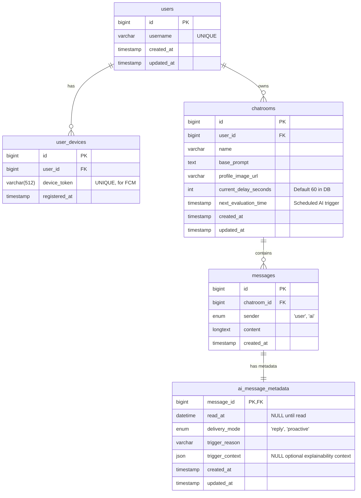

# Database Schema: Chatty

This document is the database contract for Chatty and mirrors `backend/prisma/schema.prisma`.
MySQL stores relational application data. Qdrant stores derived vector-memory points for older user messages and is documented separately below because it is not managed by Prisma migrations.

## 1. Entity-Relationship Diagram



---

## 2. MySQL DDL statements

The following SQL script represents the Prisma schema contract in MySQL form. Prisma migrations remain the source used by the application.

```sql
-- -----------------------------------------------------
-- Table `users`
-- -----------------------------------------------------
CREATE TABLE IF NOT EXISTS users (
    id BIGINT AUTO_INCREMENT PRIMARY KEY,
    username VARCHAR(255) NOT NULL UNIQUE,
    created_at TIMESTAMP DEFAULT CURRENT_TIMESTAMP,
    updated_at TIMESTAMP DEFAULT CURRENT_TIMESTAMP ON UPDATE CURRENT_TIMESTAMP
);

-- -----------------------------------------------------
-- Table `user_devices` (For FCM Push Notifications)
-- -----------------------------------------------------
CREATE TABLE IF NOT EXISTS user_devices (
    id BIGINT AUTO_INCREMENT PRIMARY KEY,
    user_id BIGINT NOT NULL,
    device_token VARCHAR(512) NOT NULL UNIQUE,
    registered_at TIMESTAMP DEFAULT CURRENT_TIMESTAMP,
    CONSTRAINT fk_user_devices_user_id
        FOREIGN KEY (user_id)
        REFERENCES users(id)
        ON DELETE CASCADE
);

-- -----------------------------------------------------
-- Table `chatrooms`
-- Includes fields specifically for the AI slow-start
-- scheduling algorithm.
-- -----------------------------------------------------
CREATE TABLE IF NOT EXISTS chatrooms (
    id BIGINT AUTO_INCREMENT PRIMARY KEY,
    user_id BIGINT NOT NULL,
    name VARCHAR(255) NOT NULL,
    base_prompt TEXT,
    profile_image_url VARCHAR(255),
    current_delay_seconds INT DEFAULT 60,
    next_evaluation_time TIMESTAMP NULL,
    created_at TIMESTAMP DEFAULT CURRENT_TIMESTAMP,
    updated_at TIMESTAMP DEFAULT CURRENT_TIMESTAMP ON UPDATE CURRENT_TIMESTAMP,
    CONSTRAINT fk_chatrooms_user_id
        FOREIGN KEY (user_id)
        REFERENCES users(id)
        ON DELETE CASCADE
);

-- -----------------------------------------------------
-- Table `messages`
-- -----------------------------------------------------
CREATE TABLE IF NOT EXISTS messages (
    id BIGINT AUTO_INCREMENT PRIMARY KEY,
    chatroom_id BIGINT NOT NULL,
    sender ENUM('user', 'ai') NOT NULL,
    content LONGTEXT NOT NULL,
    created_at TIMESTAMP DEFAULT CURRENT_TIMESTAMP,
    CONSTRAINT fk_messages_chatroom_id
        FOREIGN KEY (chatroom_id)
        REFERENCES chatrooms(id)
        ON DELETE CASCADE
);

-- -----------------------------------------------------
-- Table `ai_message_metadata`
-- 1:1 metadata for AI-authored messages only.
-- -----------------------------------------------------
CREATE TABLE IF NOT EXISTS ai_message_metadata (
    message_id BIGINT PRIMARY KEY,
    read_at DATETIME NULL,
    delivery_mode ENUM('reply', 'proactive') NOT NULL,
    trigger_reason VARCHAR(255) NOT NULL,
    trigger_context JSON NULL,
    created_at TIMESTAMP DEFAULT CURRENT_TIMESTAMP,
    updated_at TIMESTAMP DEFAULT CURRENT_TIMESTAMP ON UPDATE CURRENT_TIMESTAMP,
    CONSTRAINT fk_ai_message_metadata_message_id
        FOREIGN KEY (message_id)
        REFERENCES messages(id)
        ON DELETE CASCADE
);
```

## 3. Qdrant vector-memory contract

The backend indexes older user messages into Qdrant through `messages/memory/` and `infrastructure/vector-store/`.

- Collection name: `QDRANT_COLLECTION` (default `chat_memory`).
- Vector dimension: inferred from the configured Ollama embedding model.
- Point ID format: `<messageId>#<chunkIndex>`.
- Payload fields:
  - `chatroomId` (number)
  - `userId` (string)
  - `messageId` (string)
  - `chunkIndex` (number)
  - `chunkCount` (number)
  - `createdAt` (ISO 8601 string)
  - `sender` (`user`)
  - `content` (chunk text)

Only older user messages are indexed. Recent messages remain in the normal chat history window and are excluded from retrieval by message ID.

## 4. Implementation notes

- **Primary keys:** MySQL primary keys are auto-incrementing `BIGINT`; REST serializes them as strings for backend responses, while the frontend currently models some resource IDs as numbers.
- **Auth users:** `users.username` is unique. Login creates the user when missing and returns a JWT subject containing the user ID.
- **Proactive scheduling:** `chatrooms.current_delay_seconds` defaults to `60`; app constants set the initial evaluation delay to `4` seconds after user activity. `next_evaluation_time` is nullable and is used by the scheduled evaluator.
- **AI message metadata invariant:** `ai_message_metadata` rows are created only for `messages.sender = 'ai'` and are 1:1 keyed by `message_id`.
- **Branching behavior:** Branching copies messages into a new chatroom with the original sender, content, and `created_at` values. It does not copy `ai_message_metadata` rows.
- **Image uploads:** `chatrooms.profile_image_url` stores the URL served by the backend `/assets` static route, normally built from `PUBLIC_ORIGIN` or the incoming request host.
- **Cascades:** Deleting a user removes user devices and chatrooms; deleting a chatroom removes messages; deleting an AI message removes its metadata.
