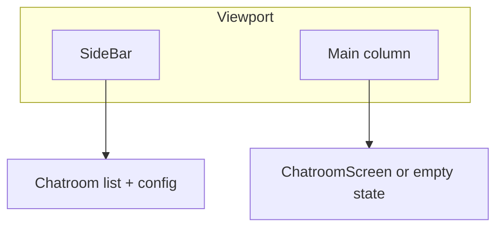

# Screens and flows

Text-only inventory (no embedded image assets). Link external mocks in task files if needed.

## App shell

- **SideBar**: Fixed width column; chatroom list, create action, per-room configuration, push controls.
- **Main**: Active `ChatroomScreen` or placeholder when no room selected.

## Screen: Login / guest

- **Trigger**: Unauthenticated or guest bootstrap (see auth hooks).
- **UI**: `LoginModal` — blocks interaction until resolved where applicable.
- **Outcomes**: Session established; guest or member.

## Screen: Chatroom (primary)

- **Route / state**: Selected chatroom id drives `ChatroomScreen`.
- **Regions** (top → bottom):
  1. Header / room context (inside screen layout).
  2. `MessageList` — scrollable; newest at bottom typical pattern.
  3. `Composer` — send user message; disabled states while sending.
- **Realtime**: Socket stream updates terminal AI message; typing via `InferIndicator` / related state.

## Screen: Create / edit chatroom

- **Create**: `CreateChatroomModal` from sidebar action.
- **Edit**: `EditChatroomModal` from room actions.
- **Clone vs branch**: Product rules in [`../PROJECT_PROPOSAL.md`](../PROJECT_PROPOSAL.md); UI must label actions clearly.

## Screen: Notifications

- **Push opt-in**: `PushNotificationButton` and registration hooks (user gesture before permission spam—see `usePushNotifications` / `useAutoPushNotifications`).
- **Foreground**: `ForegroundNotificationPopup` for received pushes when app focused.

## Anchors for task linking

Use these fragment-style ids in `related_docs` for consistency:

- `#app-shell`
- `#screen-login-guest`
- `#screen-chatroom`
- `#screen-create-edit-chatroom`
- `#screen-notifications`
